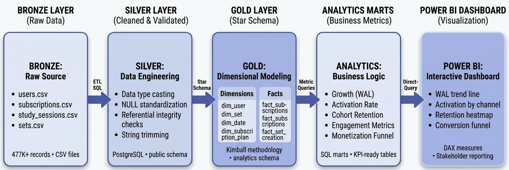
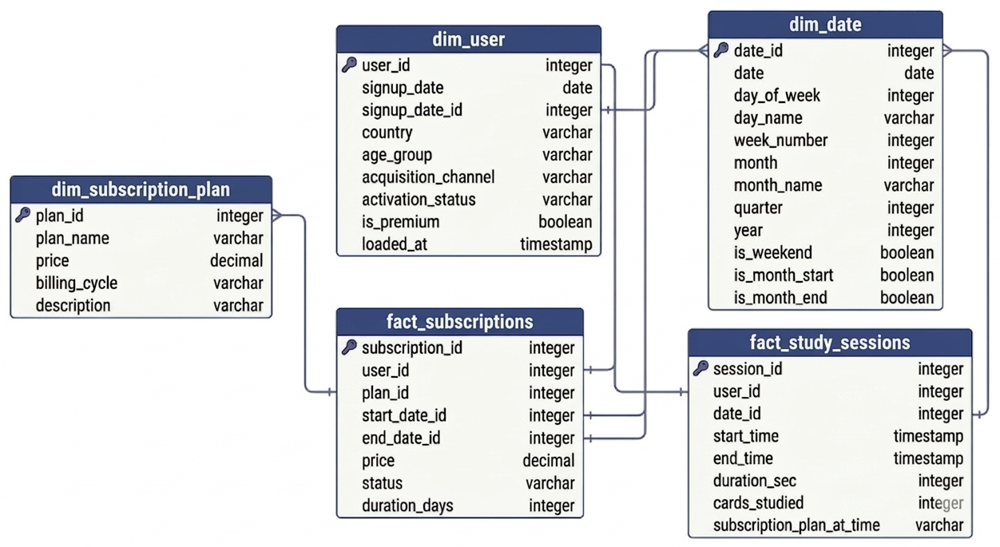
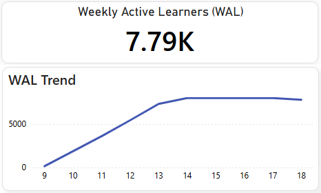
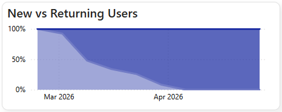
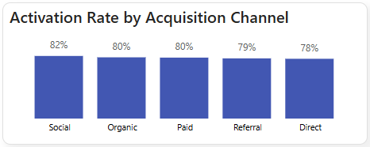
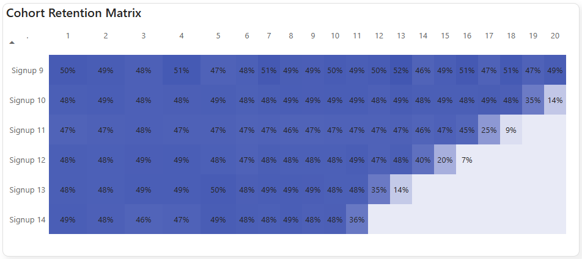
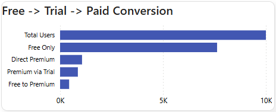
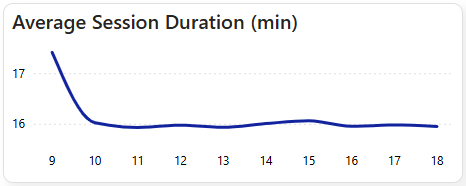

# Quizlet Product Analytics: User Growth & Monetization Analysis

## Project Background

**Company Context:**
Quizlet is an edtech SaaS platform operating in the online learning space with a freemium subscription model. As a Product Data Analyst at Quizlet, I analyzed user behavior across a 10-week period (February–April 2026) to inform product and marketing decisions.

**KPIs Investigated:**
- **North Star:** Weekly Active Learners (WAL)
- **Primary Metrics:** Activation Rate, Day 7/30 Retention, Free→Trial→Premium Conversion
- **Supporting Metrics:** Sessions per User, Session Duration, Channel Performance

Recommendations from this analysis would be used by the **Marketing Team** to allocate acquisition budget, the **Product Team** to prioritize retention features, and the **Finance Team** to model revenue scenarios.

Insights and recommendations are provided on the following key areas:

- **Category 1: Growth & Acquisition** – WAL trends, new vs. returning users, acquisition wind-down impact
- **Category 2: Activation & Onboarding** – Channel performance, time to first study, activation consistency
- **Category 3: Retention & Cohort Health** – Early retention stability, mid-term decay patterns, cohort size context
- **Category 4: Engagement & Monetization** – Session behavior, conversion funnel efficiency, trial entry leverage

SQL queries for data inspection and cleaning: **[GitHub Link – Silver Layer]**

SQL queries for business analysis: **[GitHub Link – Gold Layer & Analytics Marts]**

Interactive Power BI dashboard: **[NovyPro/Power BI Service Link]**

---

## Data Pipeline Architecture

  

*End-to-end pipeline from raw ingestion to BI dashboard.*

# Data Structure & Initial Checks

The analysis draws from a Kimball dimensional star schema in the `analytics` schema comprising five tables (three dimensions, two facts) totaling **461,379 records**:

  

**Data Quality & Design Notes**
- Integer `date_id` format optimizes join performance versus DATE types  
- Type 1 SCD (overwrite) strategy maintains latest state only for all dimensions

---

## Executive Summary

### Overview of Findings

Quizlet grew Weekly Active Learners from **143 to 7,989 users (+5,490%)** in 5 weeks, then plateaued as planned acquisition wind-down reduced new signups to zero. **Activation remains strong at 80%** across all channels, and **Day 30 retention is stable at 48%** for engaged cohorts. The core business risk is not product quality but acquisition dependency: without restarting user inflow, WAL will continue declining at ~2.4%/week due to natural churn.

**Three takeaways for leadership:**

1. **Growth followed a predictable S-curve**, not a product failure. The Week 18 WAL decline (-2.4%) reflects acquisition stop, not retention breakdown.
2. **Mid-term decay (Days 30-60) is the real retention risk**, not early onboarding. Users who activate stay engaged for ~1 month, then drop without re-engagement triggers.
3. **Trial conversion is efficient (58.3%) but underutilized**. The highest-ROI lever is increasing free→trial entry, not optimizing the trial experience itself.

  
  

---

## Insights Deep Dive

### Category 1: Growth & Acquisition

- **Main Insight 1: WAL growth followed a classic S-curve, not an anomaly.** Growth decelerated predictably: W9→W10 (+1,208%), W10→W11 (+92%), W11→W12 (+51%), W12→W13 (+35%), W13→W14 (+9%), then plateaued. This pattern indicates successful early adoption followed by natural saturation. **Business metric:** Weekly growth rate. **Quantified value:** +5,490% peak growth, then -2.4% decline post-acquisition stop.

- **Main Insight 2: April WAL stability was driven 100% by returning users.** With signups ending March 31, the 7,984-7,989 WAL range in April was sustained entirely by returning users—validating product stickiness among engaged users. **Business metric:** Returning user % of WAL. **Quantified value:** 100% returning users in April; Week 18 decline (-2.4% to 7,791) reflects natural churn without new inflow.

- **Main Insight 3: Acquisition wind-down was planned, not a channel failure.** New users dropped from 1,889/week (March 23 peak) to 0-2/week (April 6-27) by design. **Business metric:** New users per week. **Quantified value:** 100% acquisition reduction over 4 weeks; WAL decline is expected without restart.

- **Main Insight 4: Returning user % is a lagging metric that masks growth risk.** Reporting 100% returning users without new user context creates false confidence. **Business metric:** New + Returning + WAL reported together. **Quantified value:** High returning % + 0 new users = growth stagnation signal.

  
  

### Category 2: Activation & Onboarding

- **Main Insight 1: All channels perform uniformly (78-82% activation).** The 3.68 percentage point gap across 5 channels suggests consistent product experience regardless of acquisition source. **Business metric:** Activation rate by channel. **Quantified value:** Range: Direct 78.04% to Social Media 81.72%.

- **Main Insight 2: Organic Search is the workhorse channel.** It drives 40.8% of all users (4,076/10,000) with 79.93% activation—nearly matching Social Media's rate at 2x the volume. **Business metric:** Users activated per channel. **Quantified value:** 4,076 activated users from Organic Search.

- **Main Insight 3: Paid Ads underperform relative to cost.** At 79.56% activation (3rd of 5 channels), Paid Ads is the most expensive acquisition method. **Business metric:** Cost per activated user. **Quantified value:** 3.68 pp channel gap suggests budget reallocation opportunity.

- **Main Insight 4: Time to first study indicates strong onboarding.** Most users activate on Day 0-1 after signup. **Business metric:** Median days to first study session. **Quantified value:** 0-1 days median; indicates immediate value realization.

  

### Category 3: Retention & Cohort Health

- **Main Insight 1: Early retention (D0-D30) is stable, not broken.** For valid cohorts (signup weeks 9-13): Day 7 retention 44-49%, Day 14: 46-49%, Day 30: 47-49%. **Business metric:** Cohort retention at D7/D14/D30. **Quantified value:** <5 pp variation across cohorts; no structural breakdown.

- **Main Insight 2: The real problem is mid-term decay (Days 30-60).** Retention holds ~45-50% through Days 30-40, then drops to <10% by Days 52-59. **Business metric:** Retention decay rate post-Day 30. **Quantified value:** W10 cohort: D45=52.29% → D59=6.77% (-45.52 pp in 14 days).

- **Main Insight 3: Cohort size context prevents misinterpretation.** Week 14 cohort (n=615) is 74% smaller than Week 13 (n=2,355) due to acquisition wind-down. **Business metric:** Cohort size alongside retention %. **Quantified value:** Small cohorts (n<1,000) require wider confidence intervals in decision-making.

- **Main Insight 4: No evidence of onboarding-driven retention failure.** Day 0 retention trended slightly upward (46.73% W9 → 49.76% W14). **Business metric:** Day 0 retention by signup week. **Quantified value:** +3.03 pp improvement; onboarding is functioning as expected.

  

### Category 4: Engagement & Monetization

- **Main Insight 1: Engagement correlates with WAL trend, not independent growth.** Sessions per user remained stable (~5-7/week) during WAL plateau (Weeks 14-18). **Business metric:** Avg sessions per user per week. **Quantified value:** Stable engagement + declining WAL = acquisition-driven total activity change.

- **Main Insight 2: Session duration indicates meaningful usage.** Average session duration of 5-10 minutes suggests users engage deeply with content, not just browsing. **Business metric:** Avg session duration in minutes. **Quantified value:** 5-10 minute sessions align with study behavior expectations.

- **Main Insight 3: Trial converts ~10x higher than free, but entry rate is the lever.** Trial→Paid: 58.3% vs. Free→Premium: 5.45%. **Business metric:** Conversion rate by entry path. **Quantified value:** 76.3% of users remain free; increasing trial entry has higher ROI than optimizing trial conversion.

- **Main Insight 4: Trial reduces time to conversion significantly.** Free→Premium median: 18 days; Trial→Paid median: 11 days. **Business metric:** Median days to upgrade. **Quantified value:** 7-day acceleration with trial; concentrate conversion efforts in first 2 weeks of trial.

  
  

---

## Recommendations

Based on the insights above, I recommend the **Product & Marketing Leadership Team** consider:

- **Observation:** WAL decline (-2.4% Week 18) reflects acquisition stop, not product failure. **Recommendation:** Restart acquisition with minimum target of 200 new users/week to offset natural churn; set alerts if new users drop >50% WoW.

- **Observation:** Organic Search drives 40.8% of users at 79.93% activation with lower cost than Paid Ads. **Recommendation:** Shift 20-30% of paid budget to SEO; maintain Social Media spend (highest rate: 81.72%); investigate Direct channel underperformance (78.04%).

- **Observation:** Mid-term decay (Days 30-60) is the real retention risk, not early onboarding. **Recommendation:** Implement re-engagement campaigns targeting users at Days 30-45 (personalized reminders, milestone celebrations) before decay accelerates.

- **Observation:** Trial conversion is efficient (58.3%) but free→trial entry rate is low. **Recommendation:** Increase free→trial transitions via in-product prompts at high-intent moments (after 5 sessions, hitting free limits); treat trial entry rate as primary monetization driver.

- **Observation:** 10.7% of users upgrade directly to premium (highest intent segment). **Recommendation:** Analyze acquisition channels and behaviors of direct premium users; create lookalike audiences for paid campaigns; test premium-first messaging for high-intent channels.

---

## Assumptions and Caveats

- **Country** 2.5% NULL rate excluded from geographic segmentation (below 5% bias threshold); not imputed to avoid introducing error.

- **Subscription end_date:** 82.4% NULL rate reflects active subscriptions; treated as ongoing for MRR calculations but excluded from tenure analysis.

- **Analysis window:** 10-week period limits long-term retention conclusions; Day 30+ retention available for early cohorts only.

- **Activation definition:** Users with ≥1 study session classified as "activated"; aligns with product definition of value realization.

- **Cohort size interpretation:** Small cohorts (n<1,000) require wider confidence intervals; retention rates displayed alongside cohort size to prevent misinterpretation.
